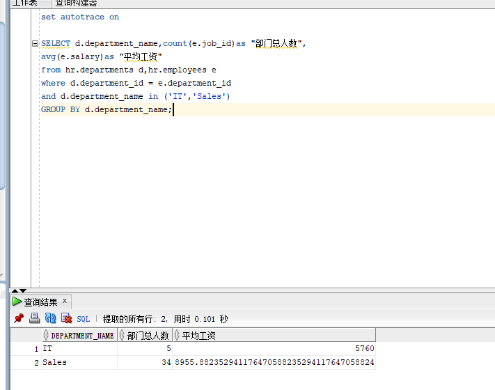
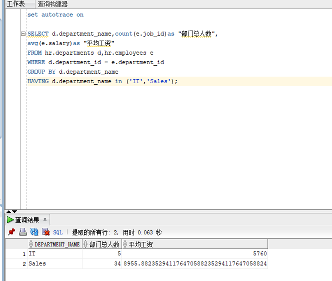
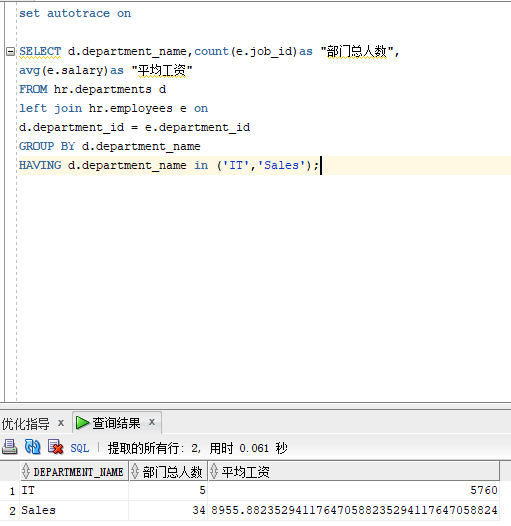

#实验一
####庄向崴 201810414129 18软工一班

##实验目的
#####分析SQL执行计划，执行SQL语句的优化指导。理解分析SQL语句的执行计划的重要作用。
##实验内容
#####1、对Oracle12c中的HR人力资源管理系统中的表进行查询与分析。
#####2、首先运行和分析教材中的样例：本训练任务目的是查询两个部门('IT'和'Sales')的部门总人数和平均工资，以下两个查询的结果是一样的。但效率不相同。
#####3、设计自己的查询语句，并作相应的分析，查询语句不能太简单。
##教材中的查询语句
#####查询1：
set autotrace on

SELECT d.department_name,count(e.job_id)as "部门总人数",
avg(e.salary)as "平均工资"
from hr.departments d,hr.employees e
where d.department_id = e.department_id
and d.department_name in ('IT','Sales')
GROUP BY d.department_name;

######结果：通过创建一个或多个索引可以改进此语句的执行计划。	
######建议：考虑运行可以改进物理方案设计的访问指导或者创建推荐的索引。	
######原理：创建推荐的索引可以显著地改进此语句的执行计划。但是, 使用典型的 SQL 工作量运行 "访问指导" 可能比单个语句更可取。通过这种方法可以获得全面的索引建议案, 包括计算索引维护的开销和附加的空间消耗。

##
#####查询2：
set autotrace on

SELECT d.department_name,count(e.job_id)as "部门总人数",
avg(e.salary)as "平均工资"
FROM hr.departments d,hr.employees e
WHERE d.department_id = e.department_id
GROUP BY d.department_name
HAVING d.department_name in ('IT','Sales');
#

######结果：查询2查询时间更短，且系统未给出优化建议，相比查询1，查询2更优。
#
#####自定义查询 ：
set autotrace on
SELECT d.department_name,count(e.job_id)as "部门总人数",
avg(e.salary)as "平均工资"
FROM hr.departments d  
left join hr.employees e on
d.department_id = e.department_id
GROUP BY d.department_name
HAVING d.department_name in ('IT','Sales');
#

######原理：我将此处查询改为左连接查询，是以左表为基础，根据ON后给出的两表的条件将两表连接起来。

