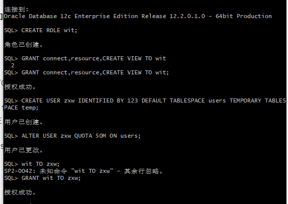
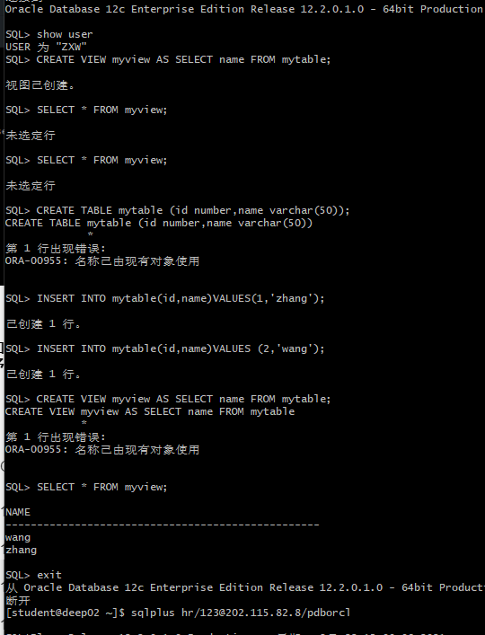
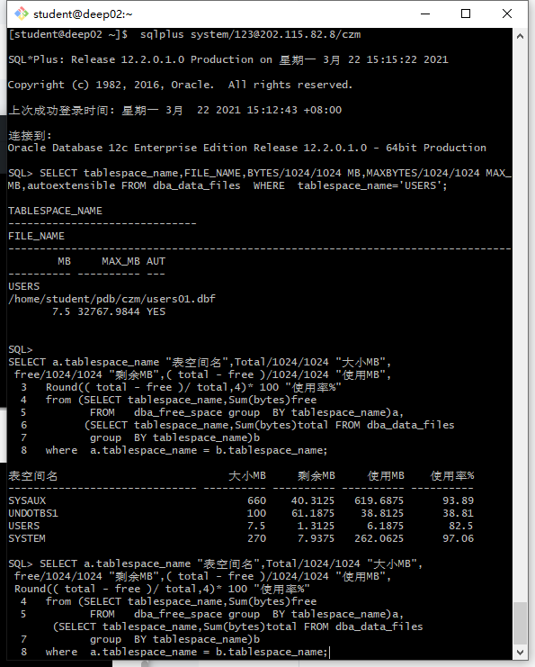

#实验二
####庄向崴 201810414129 18软工一班

##实验目的
#####掌握用户管理、角色管理、权根维护与分配的能力，掌握用户之间共享对象的操作技能。SQL语句的执行计划的重要作用。
##实验内容
#####Oracle有一个开发者角色resource，可以创建表、过程、触发器等对象，但是不能创建视图。本训练要求：
#####1、在pdborcl插接式数据中创建一个新的本地角色con_res_view，该角色包含connect和resource角色，同时也包含CREATE VIEW权限，这样任何拥有con_res_view的用户就同时拥有这三种权限。
#####2、创建角色之后，再创建用户new_user，给用户分配表空间，设置限额为50M，授予con_res_view角色。
#####3、最后测试：用新用户new_user连接数据库、创建表，插入数据，创建视图，查询表和视图的数据。

##实验步骤
#####第一步：以system登录到pdborcl，创建角色wit和用户zxw，并授权和分配空间：
$ sqlplus system/123@pdborcl
SQL> CREATE ROLE con_res_view;
Role created.
SQL> GRANT connect,resource,CREATE VIEW TO con_res_view;
Grant succeeded.
SQL> CREATE USER new_user IDENTIFIED BY 123 DEFAULT TABLESPACE users TEMPORARY TABLESPACE temp;
User created.
SQL> ALTER USER new_user QUOTA 50M ON users;
User altered.
SQL> GRANT con_res_view TO new_user;
Grant succeeded.
SQL> exit

##
#####第二步：新用户zxw连接到czm，创建表mytable和视图myview，插入数据，最后将myview的SELECT对象权限授予hr用户。
SQL> show user;
USER is "NEW_USER"
SQL> CREATE TABLE mytable (id number,name varchar(50));
Table created.
SQL> INSERT INTO mytable(id,name)VALUES(1,'zhang');
1 row created.
SQL> INSERT INTO mytable(id,name)VALUES (2,'wang');
1 row created.
SQL> CREATE VIEW myview AS SELECT name FROM mytable;
View created.
SQL> SELECT * FROM myview;
NAME

#

##### 第三步：用户hr连接到pdborcl，查询new_user授予它的视图myview
$ sqlplus hr/123@pdborcl
SQL> SELECT * FROM new_user.myview;
NAME

##### 第四步：测试其他

##### 查看数据库使用情况：
