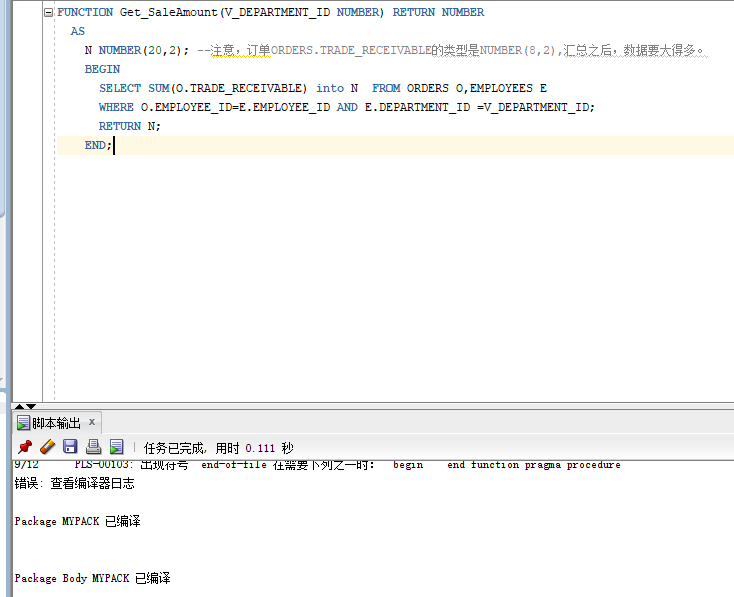
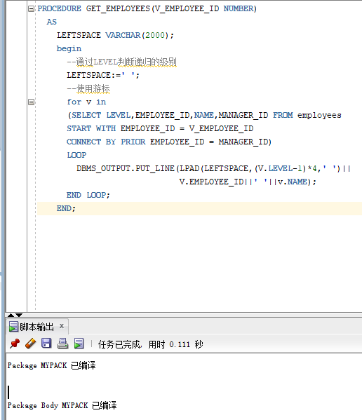
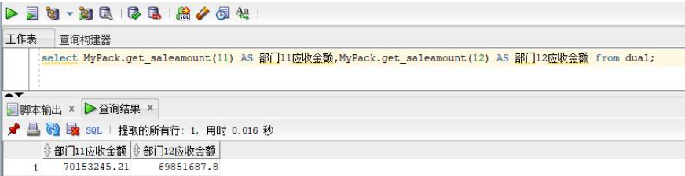

#实验四
####庄向崴 201810414129 18软工一班

## 实验目的
#####了解Oracle表和视图的概念，学习使用SQL语句Create Table创建表，学习Select语句插入，修改，删除以及查询数据，学习使用SQL语句创建视图，学习部分存储过程和触发器的使用。
##实验内容
#### 录入数据
#####1、要求至少有1万个订单，每个订单至少有4个详单。至少有两个部门，每个部门至少有1个员工，其中只有一个人没有领导，一个领导至少有一个下属，并且它的下属是另一个人的领导（比如A领导B，B领导C）。
#### 序列应用
#####2、插入ORDERS和ORDER_DETAILS 两个表的数据时，主键ORDERS.ORDER_ID, ORDER_DETAILS.ID的值必须通过序列SEQ_ORDER_ID和SEQ_ORDER_ID取得，不能手工输入一个数字。

#### 触发器的应用
#####3、维护ORDER_DETAILS的数据时（insert,delete,update）要同步更新ORDERS表订单应收货款ORDERS.Trade_Receivable的值。
#### 查询数据
1.查询某个员工的信息
2.递归查询某个员工及其所有下属，子下属员工。
3.查询订单表，并且包括订单的订单应收货款: Trade_Receivable= sum(订单详单表.ProductNum*订单详单表.ProductPrice)- Discount。
4.查询订单详表，要求显示订单的客户名称和客户电话，产品类型用汉字描述。
5.查询出所有空订单，即没有订单详单的订单。
6.查询部门表，同时显示部门的负责人姓名。
7.查询部门表，统计每个部门的销售总金额。


##
##### 第一步：运行sql脚本文件，导入相关的数据

实验四脚本文件:
运行该脚本的前题条件：
1.必须在自己的用户下运行,不能在system,sys用户运行
2.用户必须可以访问表空间USERS和USERS02
3.用户必须有创建视图权限：Create View


#

##### 第二步：查询某个员工的信息
```SQL
select * from employees where EMPLOYEE_ID='1'   
```


##### 第三步：递归查询某个员工及其所有下属，子下属员工

```sql
WITH A (EMPLOYEE_ID,NAME,EMAIL,PHONE_NUMBER,HIRE_DATE,SALARY,MANAGER_ID,DEPARTMENT_ID) AS
  (SELECT EMPLOYEE_ID,NAME,EMAIL,PHONE_NUMBER,HIRE_DATE,SALARY,MANAGER_ID,DEPARTMENT_ID
    FROM employees WHERE employee_ID = 12
    UNION ALL
  SELECT B.EMPLOYEE_ID,B.NAME,B.EMAIL,B.PHONE_NUMBER,B.HIRE_DATE,B.SALARY,B.MANAGER_ID,B.DEPARTMENT_ID
    FROM A, employees B WHERE A.EMPLOYEE_ID = B.MANAGER_ID)
SELECT * FROM A;
```


##### 第四步：查询订单表，并且包括订单的订单应收货款: Trade_Receivable= sum(订单详单表.ProductNum*订单详单表.ProductPrice)- Discount
```sql
select * FROM ORDERS
```


##### 第五步：查询订单详表，要求显示订单的客户名称和客户电话，产品类型用汉字描述：
```sql
select c.customer_name,c.customer_tel, p.product_type AS 产品类型
FROM orders c,order_details d,products p
where d.product_name=p.product_name
and  c.order_id=d.order_id 


```


#
##### 第六步：查询出所有空订单，即没有订单详单的订单。
``` sql
select * from orders 
where order_id NOT in(SELECT o.order_id from orders o,order_details d WHERE o.order_id=d.order_id)
```
###

#


#
##### 第七步：查询部门表，统计每个部门的销售总金额。
``` sql
select p.department_name,sum(sum1)
from (
select (d.product_num*d.product_price) sum1
from order_details d,orders o,departments p,employees e where p.department_id=e.department_id
and o.employee_id = e.employee_id and o.order_id=d.order_id),departments p
group by p.department_name
```
###

#

####总结：
表与视图是oracle数据库对象中最基本的也是最主要的两个对象，在开发应用中使用的也是最多的。视图不占用物理空间，这个也是相对概念，因为视图本身的定义语句还是要存储在数据字典里的。视图只有逻辑定义。每次使用的时候,只是重新执行SQL。他能提供各种数据表现形式,执行某些必须使用视图的查询. 某些查询必须借助视图的帮助才能完成。