#实验六
####庄向崴 201810414129 18软工一班

## 实验目的

``` 
自行设计一个信息系统的数据库项目，自拟某项目名称。
设计项目涉及的表及表空间使用方案。至少5张表和5万条数据，两个表空间。
设计权限及用户分配方案。至少两类角色，两个用户。
在数据库中建立一个程序包，在包中用PL/SQL语言设计一些存储过程和函数，实现比较复杂的业务逻辑，用模拟数据进行执行计划分析。
设计自动备份方案或则手工备份方案。
设计容灾方案。使用两台主机，通过DataGuard实现数据库整体的异地备份(可选)。

```

##实验场景
 作为网络社交多媒体信息传播工具之一——博客，经过多年的积淀，已成为人们日常生活不可或缺的一部分。每天，全球通过微博发送、转发、分享信息的记录破亿。随着生活水平的提高，博客不仅仅可以用来进行生活日常的分享，更多还可以是学习工作等的总结，形成一个可以多人交流的社区平台，因此选择基于Oracle的博客数据库设计。
##实验内容

####1.表，表空间设计合理，数据合理

##
##### 1.1：新键一个PDB：boke
CREATE PLUGGABLE DATABASE boke ADMIN USER admin IDENTIFIED BY 123 FILE_NAME_CONVERT=('home/oracle/app/oracle/oradata/orcl/pdbseed','home/oracle/app/oracle/oradata/orcl/weobo');   


#

##### 1.2：划分表空间，划分出3个表空间：
	1、boke_1.dbf 大小500M 每次100M 无限大小 （用于存放大量数据：4W）
	2、boke_2.dbf 大小 500M 每次 100M 无限大小 （用于存放大量数据4W）
	3、boke_3.dbf 大小 100M 每次 50M 无限大小   （用于存放少量数据 1W）
```SQL
1.create TABLESPACE usertablepspace DATAFILE   
2.'/home/oracle/app/oracle/oradata/orcl/weobo/boke_1.dbf' SIZE 500M AUTOEXTEND ON NEXT 100M MAXSIZE UNLIMITED,   
3.'/home/oracle/app/oracle/oradata/orcl/weobo/boke_2.dbf' SIZE 500M AUTOEXTEND ON NEXT 100M MAXSIZE UNLIMITED,  
4.'/home/oracle/app/oracle/oradata/orcl/weobo/boke_3.dbf' SIZE 100M AUTOEXTEND ON NEXT 50M MAXSIZE UNLIMITED   
5.EXTENT MANAGEMENT LOCAL SEGMENT SPACE MANAGEMENT AUTO;  
6.select tablespace_name status,contents,logging from dba_tablespaces;  
```
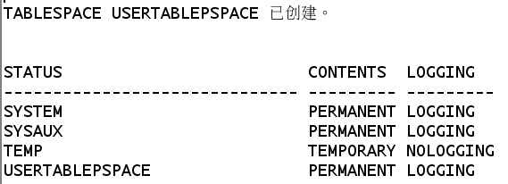
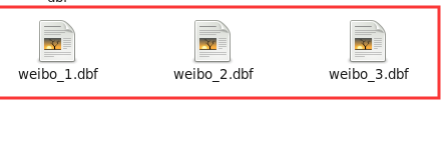

#### 2、数据库设计
表汇总
管理员表、收藏表、评论表、喜欢表、位置表、mention表、关系表、回复表、用户表、微博表


###### admin表
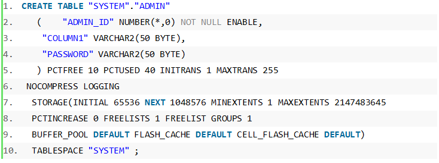

###### collect表
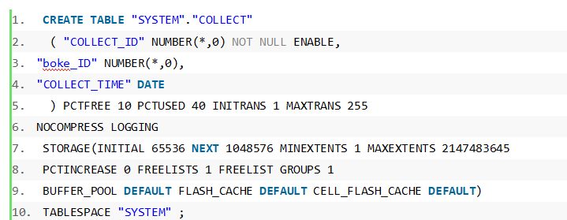

###### favor表
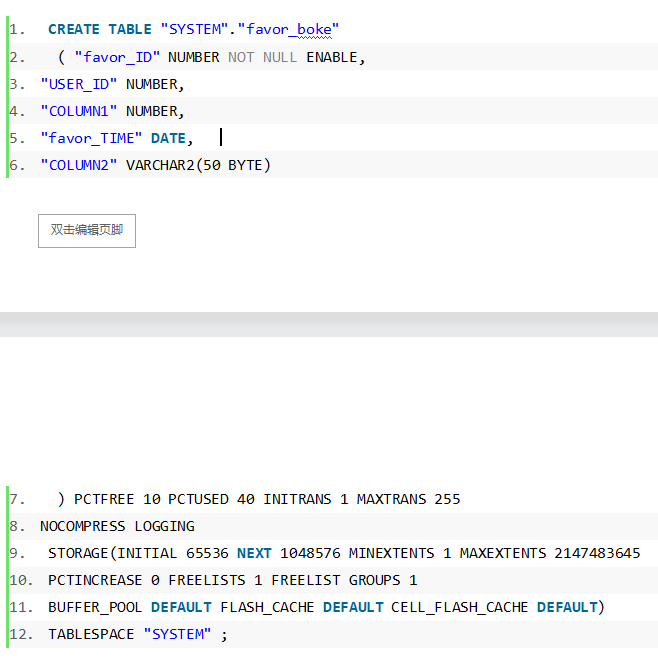

###### likes表
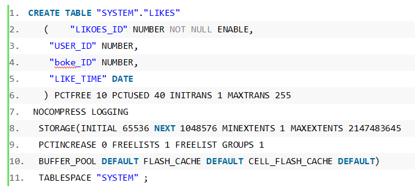

###### location表
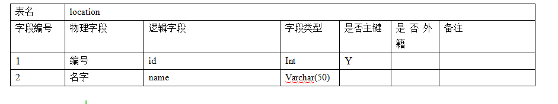

###### mention表
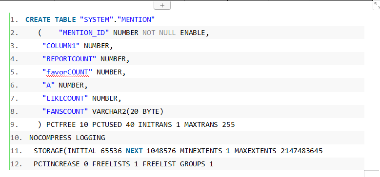

###### relation表
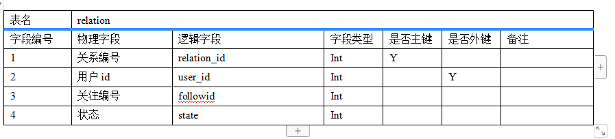

###### reply表
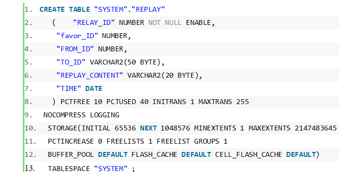

###### user表
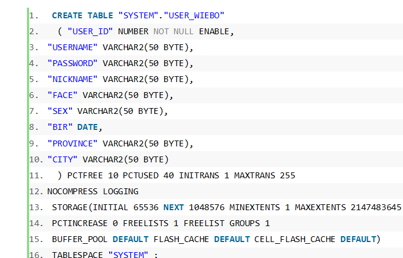

###### boke表
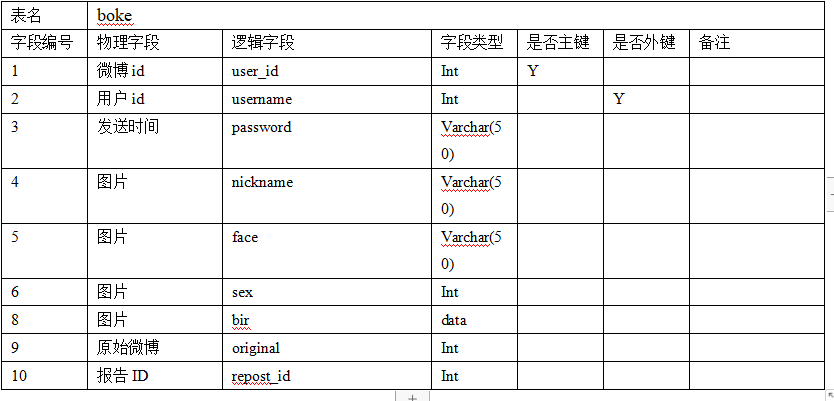


#### 3：权限及用户分配方案设计
###### 3.1 、创建1管理员个角色,创建一个管理员角色并赋予RESOURCE,CONNECT角色。
```sql
1CREATE ROLE con_res;  
grant connect,resource to con_res;
```
###### 3.2 、创建4个用户角色.
```sql
1CREATE ROLE con_res;  
1.GRANT "DBA" TO "ADMIN" WITH ADMIN OPTION;  
2.GRANT "C##CON_RES" TO "ADMIN" WITH ADMIN OPTION;  
3.GRANT "DV_MONITOR" TO "ADMIN" WITH ADMIN OPTION;  
4.GRANT "CTXAPP" TO "ADMIN" WITH ADMIN OPTION;  
5.GRANT "DV_AUDIT_CLEANUP" TO "ADMIN" WITH ADMIN OPTION;  
6.GRANT "SPATIAL_CSW_ADMIN" TO "ADMIN" WITH ADMIN OPTION;  
7.GRANT "APEX_GRANTS_FOR_NEW_USERS_ROLE" TO "ADMIN" WITH ADMIN OPTION;  
8.GRANT "WFS_USR_ROLE" TO "ADMIN" WITH ADMIN OPTION;  
9.GRANT "EM_EXPRESS_ALL" TO "ADMIN" WITH ADMIN OPTION;  
10.GRANT "WM_ADMIN_ROLE" TO "ADMIN" WITH ADMIN OPTION;  
11.GRANT "OLAP_USER" TO "ADMIN" WITH ADMIN OPTION;  
12.GRANT "OLAP_XS_ADMIN" TO "ADMIN" WITH ADMIN OPTION;  
13.GRANT "DV_SECANALYST" TO "ADMIN" WITH ADMIN OPTION;  
14.GRANT "CSW_USR_ROLE" TO "ADMIN" WITH ADMIN OPTION;  
15.GRANT "XS_CACHE_ADMIN" TO "ADMIN" WITH ADMIN OPTION;  
16.GRANT "GDS_CATALOG_SELECT" TO "ADMIN" WITH ADMIN OPTION;  
17.GRANT "SCHEDULER_ADMIN" TO "ADMIN" WITH ADMIN OPTION;  
18.GRANT "PROVISIONER" TO "ADMIN" WITH ADMIN OPTION;  
等等
```
zxw：开发用户1，只赋予boke,user_boke表的所有权限
```sql
1.CREATE USER zxw IDENTIFIED BY "123"  
2.grant all on boke to zxw;  
3.grant all on user_boke to zxw;  
```

wxz：开发用户2，赋予开发角色1的所有权限，同时开放所有的：
index, select,debug,update,delete对象给这个用户
```sql
1.CREATE USER wxz IDENTIFIED BY "123"    
2.grant all on user_boke  to wxz;  
3.grant all on boke  to wxz;  
4.grant  index,select,debug,update,delete  on admin to zxw;  
5.grant  index,select,debug,update,delete  on collect to zxw;  
6.grant  index,select,debug,update,delete  on favor_boke to zxw;  
7.grant  index,select,debug,update,delete  on likes to zxw;  
8.grant  index,select,debug,update,delete  on location to zxw;  
9.grant  index,select,debug,update,delete  on mention  to zxw;  
10.grant  index,select,debug,update,delete  on relation to zxw;  
11.grant  index,select,debug,update,delete  on replay  to zxw; 
```

wangtest：测试用户
```sql
1.CREATE USER wangtest IDENTIFIED BY "123"    
2.grant  select,debug on admin to wangtest;  
3.grant  select,debug,delete  on collect to wangtest;  
4.grant  select,debug  on favor_boke to wangtest;  
5.grant  select,debug on likes to wangtest;  
6.grant  select,debug  on location to wangtest;  
7.grant  select,debug on mention  to wangtest;  
8.grant  select,debug on relation to wangtest;  
9.grant  select,debug on replay  to wangtest;  
10.grant  select,debug on user_boke  to wangtest;  
11.grant  select,debug on seibo  to wangtest;  
```

#### 4. PL/SQL设计： 存储过程和函数设计正确
1、函数1
```sql
1.create or replace FUNCTION Get_boke(v_id  NUMBER) RETURN NUMBER  
2.AS  
3.    N NUMBER;  
4.    BEGIN  
5.        SELECT COUNT(*) INTO N from boke where boke.boke_id=v_id;  
6.        RETURN N;  
7.END;  

```


2、存储过程1
```SQL
1.create or replace PROCEDURE GET_user(v_id NUMBER, p_cur out sys_refcursor)   
2.AS  
3.BEGIN  
4.   open p_cur for SELECT *FROM user_boke where user_boke.user_id=v_id;  
5.END;  
```


#### 5. 备份方案：备份方案设计正确
1、数据逻辑备份
执行：
expdp study/123@pdborcl directory=expdir dumpfile=study.dmp  
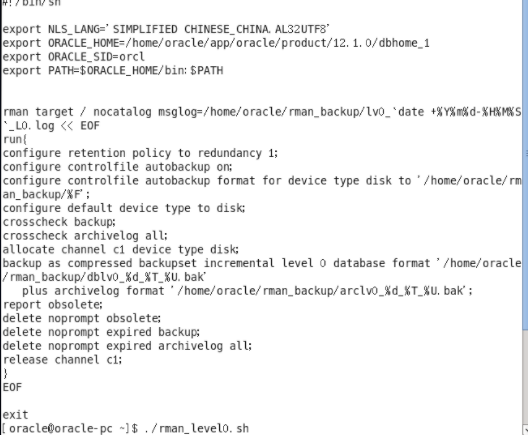
```SQL
1.Export: Release 12.1.0.2.0 - Production on 星期一 5月 25 10:42:17 2021  
2.  
3.Copyright (c) 1982, 2014, Oracle and/or its affiliates.  All rights reserved.  
4.  
5.Connected to: Oracle Database 12c Enterprise Edition Release 12.1.0.2.0 - 64bit Production  
6.With the Partitioning, OLAP, Advanced Analytics and Real Application Testing options  
7.ORA-39001: 参数值无效  
8.ORA-39000: 转储文件说明错误  
9.ORA-31641: 无法创建转储文件 "/home/oracle/expdir/study.dmp"  
10.ORA-27038: 所创建的文件已存在  
11.Additional information: 1  
12.  
13.  
14.[oracle@oracle-pc Desktop]$ expdp study/123@pdborcl directory=expdir dumpfile=study.dmp  
15.  
16.Export: Release 12.1.0.2.0 - Production on 星期一 11月 25 10:43:40 2019  
17.  
18.Copyright (c) 1982, 2014, Oracle and/or its affiliates.  All rights reserved.  
19.  
20.Connected to: Oracle Database 12c Enterprise Edition Release 12.1.0.2.0 - 64bit Production  
21.With the Partitioning, OLAP, Advanced Analytics and Real Application Testing options  
22.启动 "STUDY"."SYS_EXPORT_SCHEMA_01":  study/********@pdborcl directory=expdir dumpfile=study.dmp   
23.正在使用 BLOCKS 方法进行估计...  
24.处理对象类型 SCHEMA_EXPORT/TABLE/TABLE_DATA  
25.使用 BLOCKS 方法的总估计: 33.31 MB  
26.处理对象类型 SCHEMA_EXPORT/PRE_SCHEMA/PROCACT_SCHEMA  
27.处理对象类型 SCHEMA_EXPORT/SEQUENCE/SEQUENCE  
28.处理对象类型 SCHEMA_EXPORT/TABLE/TABLE  
29.处理对象类型 SCHEMA_EXPORT/TABLE/favor  
30.处理对象类型 SCHEMA_EXPORT/PACKAGE/PACKAGE_SPEC  
31.处理对象类型 SCHEMA_EXPORT/PROCEDURE/PROCEDURE  
32.处理对象类型 SCHEMA_EXPORT/PACKAGE/COMPILE_PACKAGE/PACKAGE_SPEC/ALTER_PACKAGE_SPEC  
33.处理对象类型 SCHEMA_EXPORT/PROCEDURE/ALTER_PROCEDURE  
34.处理对象类型 SCHEMA_EXPORT/VIEW/VIEW  
35.处理对象类型 SCHEMA_EXPORT/PACKAGE/PACKAGE_BODY  
36.处理对象类型 SCHEMA_EXPORT/TABLE/INDEX/INDEX  
37.处理对象类型 SCHEMA_EXPORT/TABLE/CONSTRAINT/CONSTRAINT  
38.处理对象类型 SCHEMA_EXPORT/TABLE/INDEX/STATISTICS/INDEX_STATISTICS  
39.处理对象类型 SCHEMA_EXPORT/TABLE/CONSTRAINT/REF_CONSTRAINT  
40.处理对象类型 SCHEMA_EXPORT/TABLE/TRIGGER  
41.处理对象类型 SCHEMA_EXPORT/TABLE/STATISTICS/TABLE_STATISTICS  
42.处理对象类型 SCHEMA_EXPORT/STATISTICS/MARKER  
43.处理对象类型 SCHEMA_EXPORT/POST_SCHEMA/PROCOBJ  
44.. . 导出了 "STUDY"."ORDERS":"PARTITION_BEFORE_2016"    268.4 KB    5000 行  
45.. . 导出了 "STUDY"."ORDERS":"PARTITION_BEFORE_2017"    268.5 KB    5000 行  
46.. . 导出了 "STUDY"."EMPLOYEES"                         70.67 KB       7 行  
47.. . 导出了 "STUDY"."DEPARTMENTS"                       5.593 KB       3 行  
48.. . 导出了 "STUDY"."PRODUCTS"                          6.296 KB      15 行  
49.. . 导出了 "STUDY"."ORDERS":"PARTITION_BEFORE_2018"        0 KB       0 行  
50.. . 导出了 "STUDY"."ORDER_DETAILS":"PARTITION_BEFORE_2016"  425.7 KB   15000 行  
51.. . 导出了 "STUDY"."ORDER_DETAILS":"PARTITION_BEFORE_2017"  426.1 KB   15000 行  
52.. . 导出了 "STUDY"."ORDER_DETAILS":"PARTITION_BEFORE_2018"      0 KB       0 行  
53.已成功加载/卸载了主表 "STUDY"."SYS_EXPORT_SCHEMA_01"   
54.******************************************************************************  
55.STUDY.SYS_EXPORT_SCHEMA_01 的转储文件集为:  
56.  /home/oracle/expdir/study.dmp  
作业 "STUDY"."SYS_EXPORT_SCHEMA_01" 已于 星期一 5月 25 10:44:55 2021 elapsed 0 00:01:14 成功完成  
```

2、自动备份
执行脚本1，内容如下：


执行脚本2，内容如下：


#### 5：容灾设计
1、基础配置

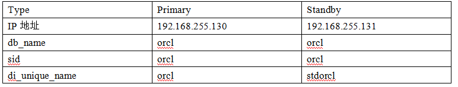

2、在备库Standby中创建以下文件：
```sql
7.mkdir -p /home/oracle/app/oracle/diag/orcl  
8.mkdir -p /home/oracle/app/oracle/oradata/stdorcl/  
9.mkdir -p /home/oracle/app/oracle/oradata/stdorcl/pdborcl  
10.mkdir -p /home/oracle/arch  
11.mkdir -p /home/oracle/rman  
12.mkdir -p /home/oracle/app/oracle/oradata/stdorcl/pdbseed/  
13.mkdir -p /home/oracle/app/oracle/oradata/stdorcl/pdb/  
```
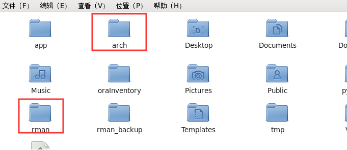


3、主库操作
```sql
1.$sqlplus /  sysdba  
2.select group#,thread#,members,status from v$log;  
3.  
4.alter database add standby logfile  group 5 '/home/oracle/app/oracle/oradata/orcl/stdredo1.log' size 50m;  
5.alter database add standby logfile  group 6 '/home/oracle/app/oracle/oradata/orcl/stdredo2.log' size 50m;  
6.alter database add standby logfile  group 7 '/home/oracle/app/oracle/oradata/orcl/stdredo3.log' size 50m;  
7.alter database add standby logfile  group 8 '/home/oracle/app/oracle/oradata/orcl/stdredo4.log' size 50m;  
```

主库强制开启归档模式
```SQL
1.ALTER DATABASE FORCE LOGGING;  
2.  
3.alter system set LOG_ARCHIVE_CONFIG='DG_CONFIG=(orcl,stdorcl)' scope=both sid='*';           
4.alter system set log_archive_dest_1='LOCATION=/home/oracle/arch VALID_FOR=(ALL_LOGFILES,ALL_ROLES) DB_UNIQUE_NAME=orcl' scope=spfile;  
5.alter system set LOG_ARCHIVE_DEST_2='SERVICE=stdorcl LGWR ASYNC  VALID_FOR=(ONLINE_LOGFILES,PRIMARY_ROLE) DB_UNIQUE_NAME=stdorcl' scope=both sid='*';  
6.alter system set fal_client='orcl' scope=both sid='*';      
7.alter system set FAL_SERVER='stdorcl' scope=both sid='*';    
8.alter system set standby_file_management=AUTO scope=both sid='*';  
9.alter system set DB_FILE_NAME_CONVERT='/home/oracle/app/oracle/oradata/stdorcl/','/home/oracle/app/oracle/oradata/orcl/' scope=spfile sid='*';    
10.alter system set LOG_FILE_NAME_CONVERT='/home/oracle/app/oracle/oradata/stdorcl/','/home/oracle/app/oracle/oradata/orcl/' scope=spfile sid='*';  
11.alter system set log_archive_format='%t_%s_%r.arc' scope=spfile sid='*';  
12.alter system set remote_login_passwordfile='EXCLUSIVE' scope=spfile;  
13.alter system set PARALLEL_EXECUTION_MESSAGE_SIZE=8192 scope=spfile;  
```

编辑主库与备库
编辑文件:/home/oracle/app/oracle/product/12.1.0/dbhome_1/network/admin/tnsnames.ora
```SQL
1.$gedit /home/oracle/app/oracle/product/12.1.0/dbhome_1/network/admin/tnsnames.ora  
2.  
3.ORCL =  
4.  (DESCRIPTION =  
5.    (ADDRESS_LIST =  
6.      (ADDRESS = (PROTOCOL = TCP)(HOST = 192.168.255.130)(PORT = 1521))  
7.    )  
8.    (CONNECT_DATA =  
9.      (SERVER = DEDICATED)  
10.      (SERVICE_NAME = orcl)  
11.    )  
12.  )  
13.  
14.stdorcl =  
15.  (DESCRIPTION =  
16.    (ADDRESS = (PROTOCOL = TCP)(HOST = 192.168.255.131)(PORT = 1521))  
17.    (CONNECT_DATA =  
18.      (SERVER = DEDICATED)  
19.      (SID = orcl)  
20.    )  
21.)  
```

回到主库，在主库上生成备份的参数文件
```SQL
SQL>create pfile from spfile;
```


将主库的参数文件，密码文件拷贝到备库
```SQL
1.scp /home/oracle/app/oracle/product/12.1.0/dbhome_1/dbs/initorcl.ora 192.168.255.131:/home/oracle/app/oracle/product/12.1.0/dbhome_1/dbs/  
2.scp /home/oracle/app/oracle/product/12.1.0/dbhome_1/dbs/orapworcl 192.168.255.131:/home/oracle/app/oracle/product/12.1.0/dbhome_1/dbs/  
```


将主库复制到备库
```SQL
1.run{   
2.allocate channel c1 type disk;  
3.allocate channel c2 type disk;  
4.allocate channel c3 type disk;  
5.allocate AUXILIARY channel c4 type disk;  
6.allocate AUXILIARY channel c5 type disk;  
7.allocate AUXILIARY channel c6 type disk;  
8.DUPLICATE TARGET DATABASE  
9.  FOR STANDBY  
10.  FROM ACTIVE DATABASE  
11.  DORECOVER  
12.  NOFILENAMECHECK;  
13.release channel c1;  
14.release channel c2;  
15.release channel c3;  
16.release channel c4;  
17.release channel c5;  
18.release channel c6;  
19.}  
```

备库操作

1、在备库上更改参数文件
```SQL
$gedit /home/oracle/app/oracle/product/12.1.0/dbhome_1/dbs/initorcl.ora  
```


在备库上增加静态监听


重新启动，备库开启实时应用模式


效果：

